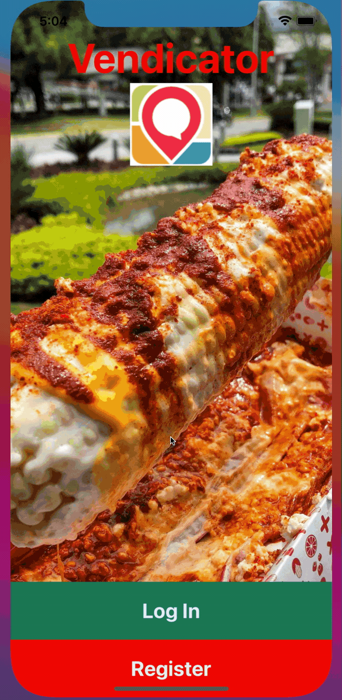
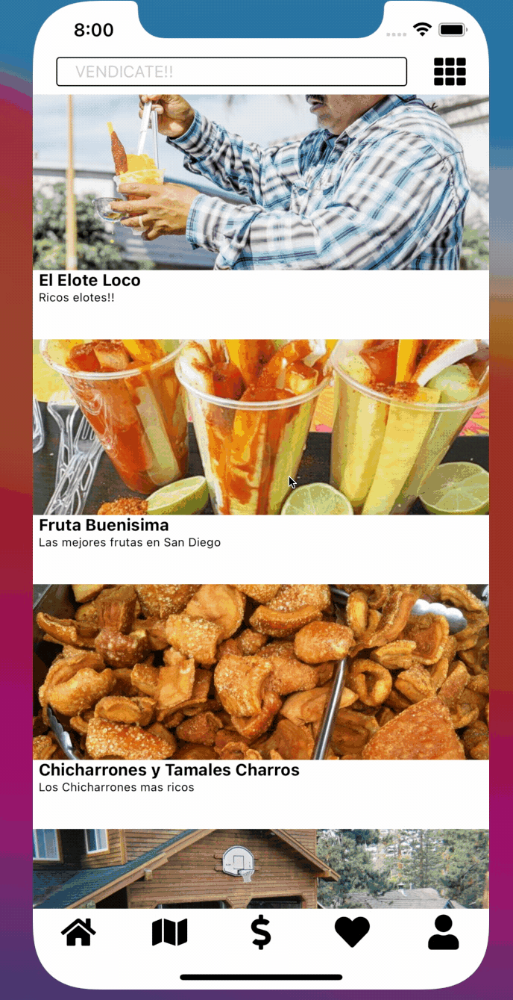
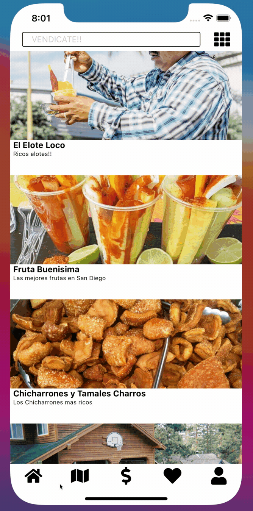

# Vendicator

  

# Contributors

[Gabe Chacon](https://github.com/gabinochacon8 "Gabe Chacon")

# Introduction
Vendicator is for micro sellers who don't get a lot of recognition. With Vendicator a vendor can indicate where they are currently located. Do you want an elote but dont know where to find one? Are you on a hunt for a yard sale on a Sunday morning? Want to workout with a personal trainer last minute? Looking for flowers for your sweetheart? Well With Vendicator you can find a vendor near you, and their exact location!

# Tech stack

<ul>
<li>React Native</li>
<li>NodeJS</li>
<li>Google Maps API</li>
<li>XCode Simulator</li>
<li>MongoDB</li>
<li>PostgreSQL</li>
</ul>

# Technical Challenges and Research

Some unexpected challenges included:

<ul>
<li>Connecting all of the tabs in the bottom bar without using a navigator</li>
<li>Using google maps api and getting map data integrated/li
<li>Finding ways to solve technical challenges without continuously downloading additional dependencies</li>
<li>The image carousel within the individual vendors</li>
</ul>

# User Stories

<ul>
<li>As a user, I expect that I can login if I have an account created</li>
<li>As a user, I should be able to create a new account to login with if I do not have one already</li>
<li>As a user, I expect to remain logged in when I leave the app if I don't click the logout button</li>
<li>As an user, I should be able to see a list of vendors with a picture and some basic information</li>
<li>As a user, I should be able to choose a vendor on the list and view their information and a list of photos</li>
<li>As a user, I should be able to search for specific vendors or look through categories to browse different vendors</li>
<li>As a user, I should be able to look at the map for nearby pins of possible vendors</li>
<li>As a user, I should be able to add a vendor to my favorites</li>
<li>As a user, be able to manage my account</li>
<li>As a user, I should be able to upload a profile photo</li>
<li>As a user, I should be able to log out</li>
<li>As a vendor, I need to be able to add my business and put it on my map</li>
<li>As a vendor, I want to be able to toggle my current location on and off</li>
<li>As a vendor, I should be able to manage my account and edit descriptions or photos</li>
<li>As a vendor, I should be able to take payment</li>
<li>As a vendor, I should have a way to track payments</li>
</ul>

# How does the app work?

App Overview:
 

App Categories:
 

Vendors:
 

Map:
 

Logout:
 

# Workflow and Key Lessons

Workflow was managed through GitHub and utilizing Agile workflow through Trello ticketing system. The team also had daily standup meetings to ensure everyone was on the same page on what was getting worked on and what still needed to be done.
